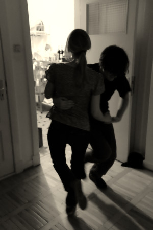

{ align=left }
**Thür**ingen**swingen** ist ein Projekt zur Förderung und Verbreitung von Musik, Tanz und Humor. Besonderes Augenmerk liegt auf den Swingtänzen der 1920er bis 1950er Jahre, insbesondere [Lindy hop](https://de.wikipedia.org/wiki/Lindy_Hop), [Charleston](https://de.wikipedia.org/wiki/Charleston_(Tanz)), [Balboa](https://de.wikipedia.org/wiki/Balboa_(Tanz)), [Shag](https://de.wikipedia.org/wiki/Shag_(Tanz)) sowie der dazu passenden Musik.
In unregelmäßigen Abständen veröffentliche ich Musikempfehlungen, stelle interessante Künstler:innen vor, zeige Fotos & Videos und verweise zu anderen Homepages und Projekten mit Bezug zum Swingtanzen. Dazwischen finden sich Neuigkeiten aus der Swingtanz Szene sowie Termin- und Ausgehtipps die keiner verpassen sollte. Der Fokus liegt hier auf Thüringen, aber gerne auch mal "überregional".

Kritik, Ideen und Tipps sind jederzeit willkommen, bitte per E-Mail an hallo@thuerswingen.de
